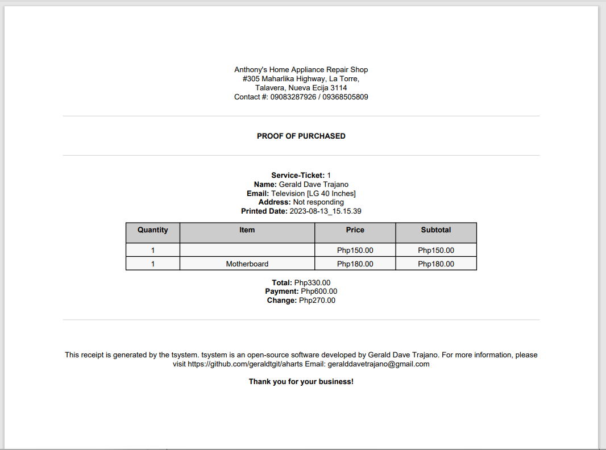
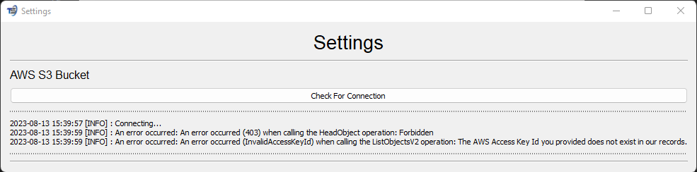

# aharts
A ticketing system for my father's Home Appliance Repair shop.

Splash screen

Menu Page:

Add New Customer Page:

Edit Customer Information Page:

Customer Database Viewer Page:

Sample log by using the script log_generator.py

Create Service Ticket Page

Troubleshooting Billing Page

Preview Receipt

Actual REceipt in PDF

AWS Account

AWS Bucket connection successful
_note: no uploaded file yet_

UI if no connection

tsystem logo/icon

